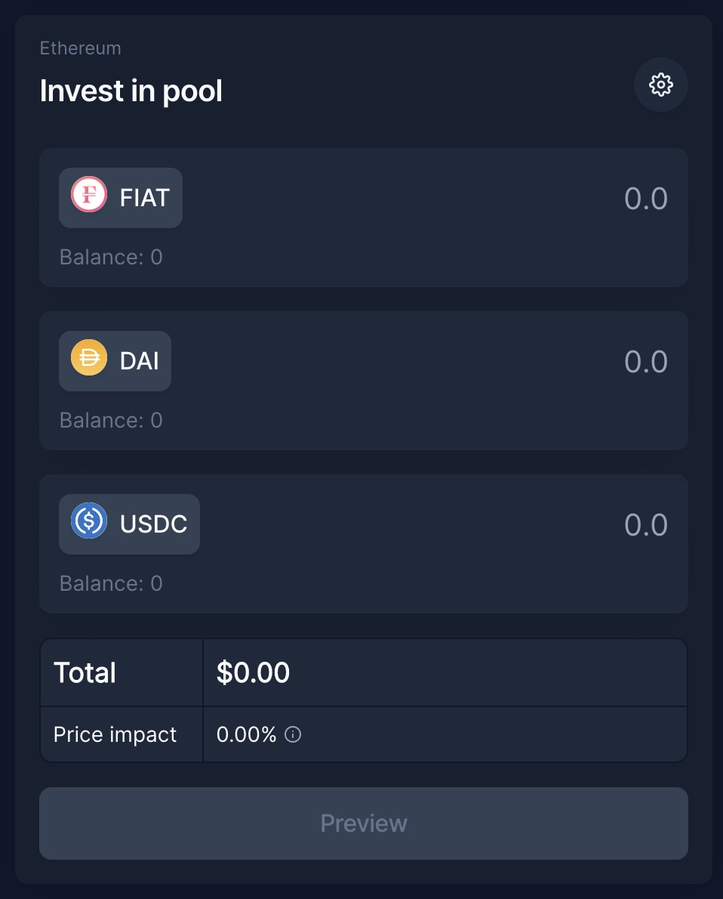
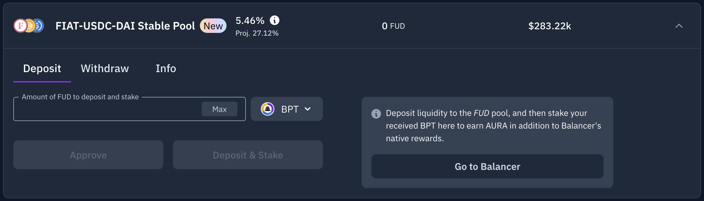
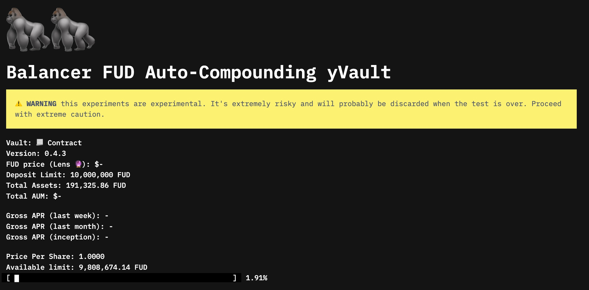

# 🇨🇭 Deploying Paired Liquidity

## Guide Intro

$FIAT requires deep secondary liquidity in order to facilitate its core use cases. This guide provides a walkthrough on how to contribute to both $FIAT circulating supply and secondary liquidity.

**What You'll Need:**

* $USDC or $DAI for deposits
* $ETH for gas fees

**What Protocols You'll Potentially Use:**

* Collateral Partner ([Element](https://element.fi), [Notional](https://notional.finance), or [Yield](https://yieldprotocol.com))
* [Balancer Finance](https://balancer.fi)
* [Aura Finance](https://aura.finance)
* [Yearn Finance](https://yearn.finance)

**End Goal**

By the end of this guide, you'll have created a collateral position, minted $FIAT, paired it against either $USDC or $DAI on Balancer Finance, and begun to earn subsidies.&#x20;

## How-To Guide

### Step 1. Mint $FIAT

* Navigate to [https://app.fiatdao.com](https://app.fiatdao.com)
* Select a collateral option from your preferred issuer
* Deposit your collateral and mint $FIAT with enough of a buffer to avoid liquidation


Stablecoin-denominated positions can be liquidated due to depegs or interest accumulation. **Health scores greater than 1.025 are recommended.**&#x20;


### Step 2. Pair $FIAT

* Navigate to the "FUD" (FIAT-USDC-DAI) pool on [Balancer Finance](https://app.balancer.fi/#/pool/0x178e029173417b1f9c8bc16dcec6f697bc32374600000000000000000000025d)
* Deposit your $FIAT alongside equal amounts of $DAI or $USDC


It is possible to deposit any combination of the three assets.


### Step 3. Choose Your Reward

Once you have received the [proof-of-liquidity token](https://etherscan.io/address/0x178e029173417b1f9c8bc16dcec6f697bc323746) from Balancer Finance, you can choose to deposit it in one of following three options:

#### Option 1: Voting-Escrow Balancer

Balancer Finance emits reward tokens across its pools on weekly cycles. To receive those directed at the FUD pool, you can stake your proof-of-liquidity on the same page as where you initially deposited your assets.&#x20;

The value of the subsidy you receive is a function of the following considerations:

* The amount of [$BAL](https://www.coingecko.com/en/coins/balancer) token emissions targeted at the pool in a given week
* Your share of the total pool size
* The boosted share you receive as a function of any [veBAL](https://app.balancer.fi/#/vebal) balance you may have
* The value of the $BAL token upon your claim

**Option 2: Vote-Locked Aura**

Aura Finance is an aggregator protocol built on top of Balancer Finance. It allows you to benefit from boosted $BAL emissions it receives due to its accumulated veBAL treasury. It further subsidizes your participation via the emissions of its own governance token, [$AURA](https://www.coingecko.com/en/coins/aura-finance).&#x20;

To utilize the platform, you must  deposit your Balancer proof-of-liquidity in their smart contract.

The value of the subsidy you receive is the same as with depositing directly with Balancer Finance, except with Aura Finance, you are likely to receive a higher governance boost, plus the value of their $AURA emissions.

**Option 3: Auto-Compounding Aura Strategy**

Lastly, you can choose to deposit your Balancer pool token with Yearn Finance via their vault smart contract found on [Ape Tax](https://ape.tax/0xA9412Ffd7E0866755ae0dda3318470A61F62abe8). While this introduces yet another risk vector in the form of smart contract vulnerability risk, it does present the opportunity for higher yields than the other options.&#x20;

This vault strategy deposits into Aura Finance a la Option 2, but it auto-compounds subsidies received, selling the $BAL and $AURA earned for more of the underlying FUD pool tokens.&#x20;

## End Result

### Overview

Successful execution of this guide will result in the following outcomes:

*   **Income:**

    * Collateral's Fixed Yield
    * Balancer Pool Trading Fees
    * Balancer Pool Subsidies
    * Aura Finance Subsidies
    * Yearn Finance Auto-Compounding

*   **Costs:**

    * Gas Fees
    * FIAT Interest Charged
    * Yearn Finance Yield Fee

* **Risks:**
  * Collateral Issuer Counterparty Risk
  * Balancer, Aura, or Yearn Finance Smart Contract Risk
  * $USDC, $DAI, or $FIAT Depeg Risk

### Example Position

An example end position could look as follows:

1. User starts with 10,000 $USDC
   * User deposits 5,000 $USDC into Notional fUSDC and secures a 4.8% fixed yield
2. User deposits 5,240 12-month dated $fUSC into FIAT DAO
   * FIAT assesses its value at $0.96 on the dollar and enforces a 105% marginal collateralization ratio
   * User mints 4,700 $FIAT in order to preserve a 1.02 health score on the position
   * User is being charged an annualized 1% interest rate on their $FIAT debt
3. User pairs 4,700 $FIAT against the remaining 5,000 $USDC in the Balancer FUD pool
   * User can further decide whether to deposit into either Aura or Yearn Finance
4. Upon collateral maturity, user withdraws from Balancer pool and repays debt
   * User will owe 4747 $FIAT to unlock their collateral

In the interim period, the user could have minted further $FIAT as the discount rate decreased closer to collateral maturity.&#x20;

### $FIAT Depeg Considerations

The term "stablecoin" can refer to any number of mechanisms of varying robustness used to peg an asset at a specific value. $FIAT is built on top of the collateral debt position model pioneered by MakerDAO and its $DAI token. This is a far cry from robust designs, namely the "algorithmic" approach taken by the failed Terra Luna project. ****&#x20;

The following table highlights how much USDC you would need to be able to withdraw from the Balancer pool in the case of a given depeg in order to **i) reclaim your collateral**, and **ii) recover your entire principal** before yields or subsidies are considered, utilizing the example position figures.&#x20;

* **5,240 $fUSDC collateral**
* **4,747 $FIAT debt after one year**
* **$9,700 original Balancer deposit value**

| Secondary Price of $FIAT | Cost of Debt Repayment | Breakeven USDC Withdrawal Amount |
| ------------------------ | :--------------------: | :------------------------------: |
| $0.95                    |        $4,509.65       |           9,269.65 USDC          |
| $0.90                    |        $4,272.30       |           9,032.30 USDC          |
| $0.85                    |        $4,034.95       |           8,794.95 USDC          |
| $0.75                    |        $3,560.25       |           8,320.25 USDC          |
| $0.50                    |        $2,373.50       |           7,133.50 USDC          |

It is important to note that the reasons for such deviations can vary, and the severity of their underlying cause can mean the difference between a temporary dislocation and a permanent discount.

* **Temporary dislocations** are caused by there being an excess of $FIAT in the market relative to demand. In such cases, users with $FIAT debt have an incentive to buy cheap $FIAT to pay down their positions, eventually restoring equilibrium.
* **Permanent discounts** are caused by unmitigated devaluations of the collateral backing circulating $FIAT, to the point where users have no incentive to pay back their debts for worthless collateral. Bad debt can be mitigated via the sale of $FDT governance tokens or compelling yield opportunities for $FIAT holders, and so such scenarios must be assessed on a case by case basis.

All of this is to say that there is risk in providing liquidity against $FIAT, but in most scenarios, this risk is a temporal one rather than an outright bankrun scenario on the Balancer liquidity pool. Users who are able to arbitrage temporary dislocations can even profit from such scenarios, as their take home yield winds up being higher due to the cheaper cost of $FIAT debt repayment.

### Closing Comments

By executing this strategy, the user contributes to the overall secondary liquidity for $FIAT in return for lending yields, trading fees, and protocol subsidies. In pairing minted $FIAT against their own $USDC or $DAI liquidity, they are able to profit from volatility that may result from excess amounts of $FIAT in the Balancer pool, as such events allow for cheap repayment of their minted debt.&#x20;

Importantly, the presence of such paired liquidity allows for less risk-averse users to execute releveraging strategies with a smaller impact on the secondary price of $FIAT.
