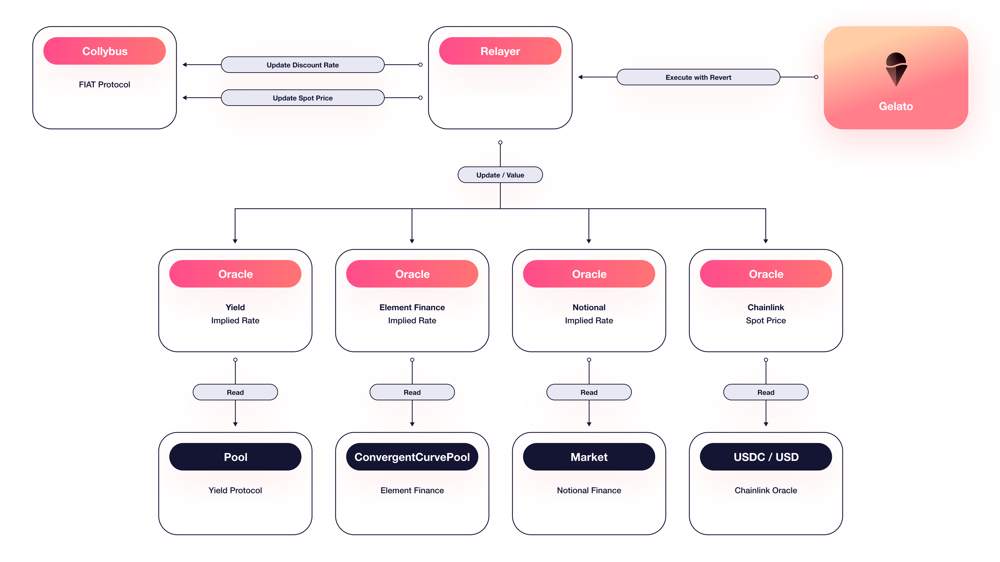

# 🔮 Delphi Oracle

### 🔎 High-level Overview

FIAT DAO needs a system that gathers information about the integrated assets in our protocol. These assets need to be correctly priced to keep the $FIAT token value close to the desired peg.

Our oracle system is highly dependent on the correctness of on-chain data and trusted oracle systems (such as [Chainlink](https://chain.link/)) for correct execution and data flow.

FIAT DAO lets people deposit assets as collateral in personal vaults, which, in effect, allow them to mint a stable coin based on the deposited value. The protocol needs to access price feeds for all supported collateral assets.

For instance, to support [Element Finance Principal Tokens](../collateral-vaults/element-finance-principal-token.md) based on [USDC](https://www.circle.com/en/usdc), we need to be able to price Principal Token correctly. This is achieved by tracking the Principal Token's value and the value of the underlying USDC token. Tracking the value of the Principal Token is done with a static relayer based on the remaining maturity date, while the price of USDC is tracked with a Chainlink spot price relayer. Each of these will be explained in detail.

### 🎨 Oracle Design

The Delphi Oracle System has the following high-level overview schema.

Each component is detailed in its respective section; this provides an overview of the execution flow and architecture.

The execution flow starts with a [cron](https://en.wikipedia.org/wiki/Cron)-like system that tries to update the oracle values by calling the [Relayer](v1/relayer.md). If the relayer considers the values should be updated and pushed into Collybus, a transaction is sent to the blockchain, performing the needed updates.

Collybus will price the supported assets differently based on Delphi's pushed values.

### 👒 Security and Risks

Given the importance of correctly pricing the supported assets, we tried to create a resistant system to malicious manipulation. It is also vital to allow it to react quickly if the market asset values change.

The security of Delphi heavily relies on the safety and correctness of the on-chain value providers.

#### 🚄 Frontrunning

Frontrunning and sandwiching transactions are attack vectors we considered when we designed Delphi.

We protect from transaction reordering by:

* guarding the `update()`  method, allowing only a specific set of actors to trigger oracle updates;
* using a private transaction relayer; does not publicly add the pending transaction to the public [mempool](https://etherscan.io/txsPending).

We considered an attack vector if a malicious actor wants to manipulate an on-chain value right before that value is read by our oracles. We assume a high cost of keeping that value significantly different from the actual value. Suppose the value is manipulated to be different from what the world considers the actual value; we assume actors that arbitrage the markets will act as an opposing force pushing the value to its actual value.

#### 👩‍⚖️ Vetoing values

Our oracles also have a waiting period that allows a select group of people to react in case the value that is about to be reported is incorrect. This is similar to how other protocols allow pausing (see [Maker](https://docs.makerdao.com/smart-contract-modules/governance-module/pause-detailed-documentation) and [Reflexer](https://docs.reflexer.finance/risk/pid-failure-modes-and-responses#market-manipulation)).

Vetoing the value can be done by also resetting the oracle value, in addition to pausing the system. This can force the attacker to pay the price of manipulating the markets once again. Again, we consider the price of manipulation high and unfeasible.

Mode details about vetoing the values is found in the [Oracle page](v1/oracle.md).

#### 🚿 Data Source

We pick carefully the data sources when we deploy the oracles. At the moment deploying an oracle and including it in the global system is a trusted action, no random actor can create and use their own data source. Our governance defines the accepted data sources and can do the necessary actions to add a new data feed.

### 📘 References

* [GitHub repository](https://github.com/fiatdao/delphi)
